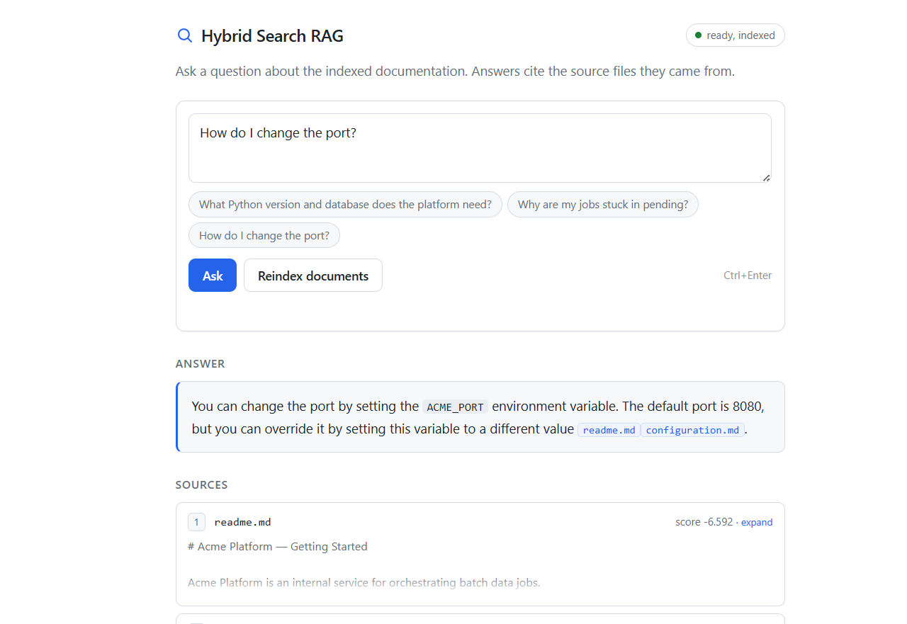
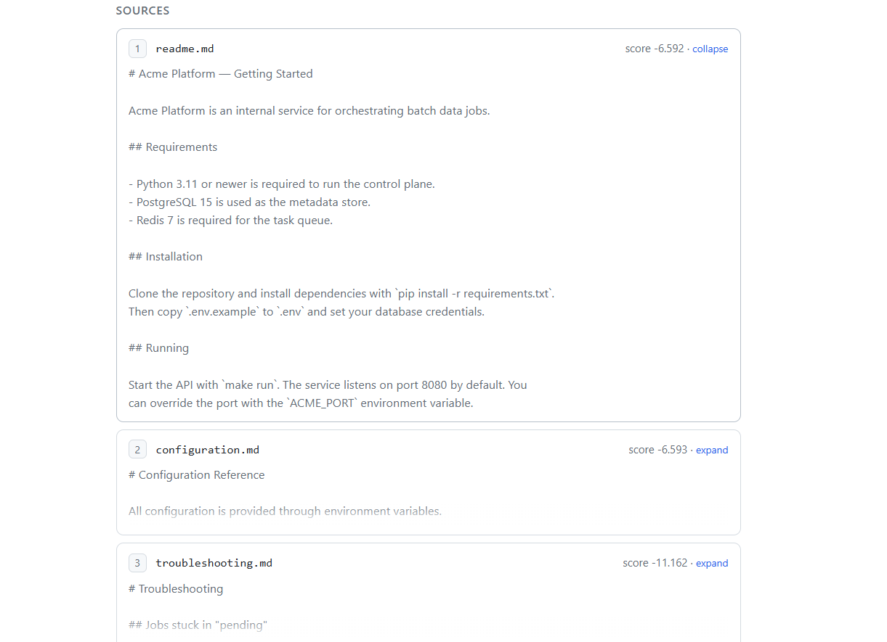

# Hybrid Search RAG over Internal Docs

[](https://github.com/houas-sarah/hybrid-search-rag/actions/workflows/ci.yml)

**Live demo:** https://sarahouas-hybrid-search-rag.hf.space — it's on a free
Hugging Face Space, so give it ~30s to wake up on the first hit.

Point it at a folder of Markdown/text docs, ask a question, and get an answer
with citations back to the files it came from. It all runs locally: dense search
(ChromaDB + a sentence-transformers model), keyword search (BM25), the two
blended with Reciprocal Rank Fusion, a cross-encoder to rerank, and Ollama or
Groq for the final answer. No paid API keys.

I built this to have a clean end-to-end example of hybrid retrieval done
properly, instead of the usual "throw everything at a vector DB" demo.



## How it works

1. Docs get split into ~512-token chunks (recursive splitter, ~10% overlap).
2. Each chunk lands in two indexes: ChromaDB (vectors) and BM25 (keywords).
3. A query hits both at the same time, the two ranked lists are merged with RRF
   (k=60), the shortlist is reranked by a cross-encoder, and the top 3 chunks go
   to the model.
4. The model answers from those chunks only and cites the filenames.

### Answers cite their sources

Every claim points back to where it came from, e.g. *"The setup requires Python
3.11 [readme.md]."* Under each answer you get the chunks that were actually
retrieved — click one to read the whole passage.



## Layout

```
main.py                 FastAPI app: /, /ingest, /query, /health
check_backend.py        one-off script to test the LLM backend
config/settings.py      pydantic-settings, read from .env
models/schemas.py       domain models + API request/response
ingestion/              loader, recursive chunker, indexing pipeline
retrieval/              embedder, chroma store, bm25, rrf, reranker, hybrid
generation/             prompt + Ollama/Groq backends
services/rag_service.py wires it together
static/index.html       web UI
tests/                  pytest suite
evaluation/             offline eval: labeled set + retrieval/generation metrics
```

Imports only point inward: `main -> services -> {ingestion, retrieval,
generation} -> models/config`.

## Setup

```bash
python -m venv .venv
.venv\Scripts\activate          # Windows  (source .venv/bin/activate elsewhere)
pip install -r requirements.txt
```

The first run pulls the embedding and reranker models (~170 MB) from Hugging
Face once, then it's offline.

### Pick an LLM backend

Local, with Ollama:

```bash
# install from https://ollama.com, then
ollama pull llama3
```

Or Groq's free tier if you'd rather not install anything — copy `.env.example`
to `.env` and set:

```
LLM_PROVIDER=groq
GROQ_API_KEY=gsk_...            # grab one at https://console.groq.com
```

Either way the indexing, retrieval and reranking stay local; only the final
answer uses the model you picked.

## Running

```bash
uvicorn main:app --reload
```

- Web UI:   http://localhost:8000
- API docs: http://localhost:8000/docs

Hit *Reindex documents*, then ask away. Or from the terminal:

```bash
curl -X POST http://localhost:8000/ingest
curl -X POST http://localhost:8000/query -H "Content-Type: application/json" \
  -d '{"query": "What Python version and database does the platform need?"}'
```

Want to use your own docs? Drop `.md`/`.txt` files into `data/docs/` and reindex.

## Docker

```bash
docker compose up --build        # Groq backend; put GROQ_API_KEY in .env first
```

For a local model instead, set `LLM_PROVIDER=ollama` and
`OLLAMA_HOST=http://ollama:11434` in `.env`, then:

```bash
docker compose --profile local-llm up --build
docker compose exec ollama ollama pull llama3
```

Want it hosted? See [DEPLOY.md](DEPLOY.md) for a free Hugging Face Spaces setup.

## Tests

```bash
pip install -r requirements-dev.txt
pytest
```

Covers the chunker, RRF, the BM25 and Chroma stores, loading, settings and the
eval metrics — no network or LLM needed. Same thing runs in CI on every push
(`.github/workflows/ci.yml`, Python 3.11 and 3.12).

## Evaluation

There's a small labeled question set (`evaluation/eval_set.json`) and a runner
that scores the pipeline — because "it works on my one test question" isn't a
number you can put in a README:

```bash
python -m evaluation.evaluate            # retrieval + generation
python -m evaluation.evaluate --no-gen   # retrieval only (no LLM)
```

- **Retrieval** — hit@k / recall@k / MRR: does the right doc come back, and how
  high in the ranking?
- **Generation** — citation faithfulness (are the cited files actually in the
  retrieved context, i.e. nothing invented?), whether a relevant source was
  cited, and keyword coverage as a cheap correctness proxy.

On the bundled sample docs:

```
Retrieval                 Generation
  hit@1      1.00           citation faithfulness    1.00
  recall@1   0.95           cited a relevant source  1.00
  recall@3   1.00           keyword coverage         1.00
  MRR        1.00
```

Fair warning: these are high mostly because the sample corpus is three short,
very distinct docs. The point is the harness — on a bigger, messier corpus the
same numbers actually start to hurt, and that's where you'd tune chunk size,
`top_k` and the reranker. Add rows to the JSON to grow the set.

## A few honest notes

- `all-MiniLM-L6-v2` truncates at 256 tokens, so with the default 512-token
  chunks only the first 256 tokens get embedded. Set `CHUNK_SIZE=256` for
  full-chunk embeddings, or swap in a longer-context model.
- Ingestion rebuilds both indexes from scratch every run. Wasteful, but instant
  at this size and the two indexes can't drift apart.
- The docs under `data/docs/` are made up (a fictional "Acme" platform) — swap
  in your own.
